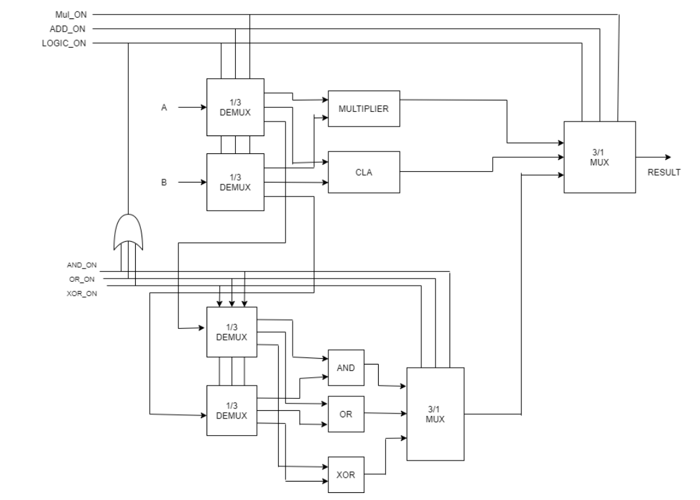

# 🧠 ASIC Implementation of a 16-Bit Asynchronous ALU 

## 📌 Project Overview

This project presents the **ASIC design of a 16-bit asynchronous Arithmetic Logic Unit (ALU)** optimized for **ultrasound medical imaging CPUs** and other low-power embedded systems. Designed in **Verilog**, this ALU supports a range of arithmetic and logical operations using a modular **datapath-control architecture**.

The design is verified through functional simulation using **Mentor QuestaSim** and synthesized using **Cadence Genus** and PnR done using **Cadence Innovus**, targeting a **45nm CMOS process** with ultra-low power and minimal area.

---
### ✅ Supported Operations
- Addition
- Multiplication
- AND
- OR
- XOR
- 

## 🛠️ Tools & Technologies

| Category         | Tools/Tech Used                                |
|----------------- |------------------------------------------------|
| 💻 HDL          | Verilog                                        |
| 🧪 Simulation   | Xilinx Vivado, Mentor Questasim                |
| ⚙️ Synthesis    | Cadence Genus Synthesis Solution               |
| 🧱 PnR          | Cadence Innovus Implementation System          |
| 🧾 Tech Node    | 45nm CMOS                                      |
| ⚡ Voltage      | 0.9V                                           |
| 🕒 Frequency    | 10 MHz                                         |

---

## 🧬 Features

- ✅ Fully asynchronous design using **handshaking protocol**
- ➕ 16-bit **Addition** (Carry Look Ahead Adder)
- ✖️ 16-bit **Multiplication** (Array Multiplier, 12-bit × 4-bit)
- 🧠 Logic operations: **AND**, **OR**, **XOR**
- 🔄 Single-cycle back-to-back execution
- 💡 Ultra-low power & area efficient for embedded systems

---

## 📊 Results Summary

| Metric                     | Result                          |
|---------------------------|----------------------------------|
| ⚡ Total Power             | **523 nW**                      |
| 🔋 Leakage Power           | 27.5 nW (5.27%)                 |
| 🔄 Switching Power         | 137.4 nW (26.27%)               |
| 🔌 Internal Power          | 358 nW (68.46%)                 |
| 📐 Area                   | **1454.184 μm²**                |
| 🔢 Gate Count              | **1418 NAND2X1 equivalent**     |
| ⏱️ Timing Slack            | **89.3 ns**                     |
| 📅 Min Clock Period        | ~10.669 ns (~93.75 MHz max)     |

---

## 🧾 Architecture Block Diagram

>  
---

## ⚖️ Benchmark Comparison

| Design Ref | Power     | Area           | Technology |
|------------|-----------|----------------|------------|
| [2]        | 8.467 mW  | 19845 μm²      | 180nm      |
| [5]        | 7.2 μW    | 68734 gates     | 65nm       |
| [6]        | 4.035 mW  | 69013.952 μm²  | 180nm      |
| **This**   | **523 nW**| **1454.184 μm²**| **45nm**   |

---

4. Run Place and Route in Cadence Innovus

## 🚀 How to Run Simulation (Mentor QuestaSim or Vivado)
1. Clone the repository:
   <pre>
   git clone https://github.com/sanjidat/ASIC-Implementation-of-16-Bit-Asynchronous-ALU.git
   cd ASIC-Implementation-of-16-Bit-Asynchronous-ALU
   </pre>

2. Open Mentor QuestaSim GUI (or Xilinx Vivado)

3. Manually compile your Verilog files:

   alu.v, cla_16bit.v, and other source files

   alu_tb.v (testbench)

4. Run the simulation in GUI or console

5. Add signals to waveform window and run simulation

6. Analyze waveforms for verification

OR

Run the testbench using QuestaSim:
<pre>
vsim -c -do simulation/run_sim.tcl
</pre>

🖼️ Waveform screenshots are provided in /simulation/images/.

## 🏭 Synthesis (Cadence Genus)

<pre>
genus> read_hdl src/alu.v src/cla_16bit.v ...
genus> elaborate
genus> synthesize -to_mapped
genus> report_area
genus> report_power
</pre>

## 🧱 Physical Design (Cadence Innovus)
Floorplanning, placement, clock tree synthesis, and routing done using Innovus

Timing reports show positive slack, validating functional integrity

## 🧠 Why Asynchronous?

- 🚫 No global clock = no clock skew

- 🔌 Only switches when needed = low power

- 🔄 Handshaking protocol = robust data flow

- 🧪 Tolerant to process & voltage variations

- 📚 License

This project is academic work. For reuse or citation, please contact the author.

### References

[2] O. Dave, D. S. Yadav, J. Kothari, and P. Jayakrishnan, "ASIC implementation of pipelined ALU," in *2013 International Conference on Green Computing, Communication and Conservation of Energy (ICGCE)*, pp. 191–194, 2013.

[5] W.-G. Ho, K.-S. Chong, B.-H. Gwee, and J. S. Chang, "Low power sub-threshold asynchronous QDI static logic transistor-level implementation (SLTI) 32-bit ALU," in *2013 IEEE International Symposium on Circuits and Systems (ISCAS)*, pp. 353–356, IEEE, 2013.

[6] S. Shukla and K. C. Ray, "Design and ASIC implementation of a reconfigurable fault-tolerant ALU for space applications," in *2019 IEEE International Symposium on Smart Electronic Systems (iSES) (Formerly iNiS)*, pp. 156–159, 2019.

